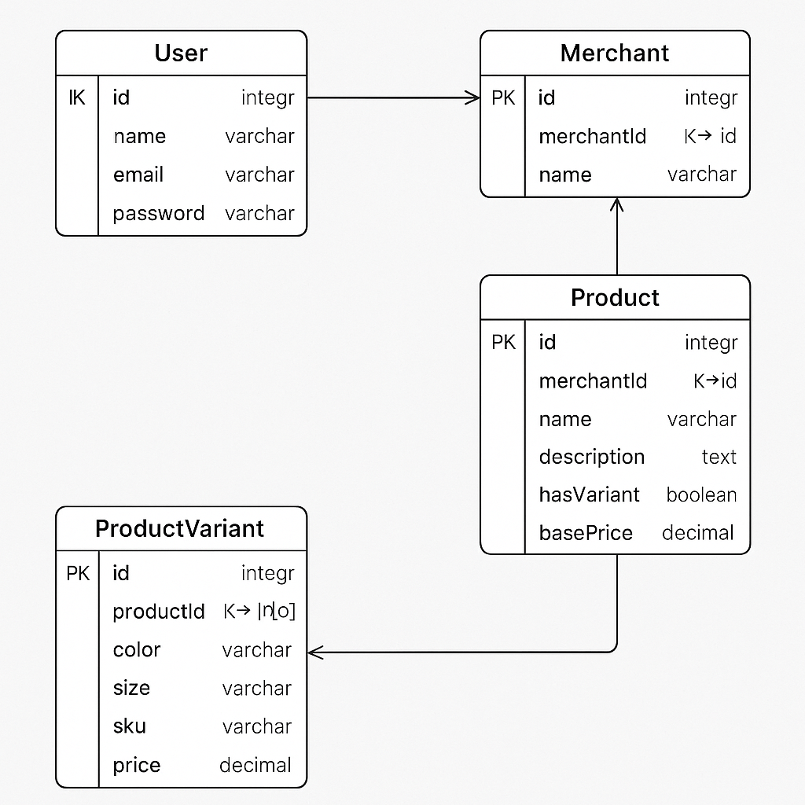

# Sellerpintar Backend

Sistem backend untuk mengelola data pengguna, merchant, dan produk dengan variasi menggunakan Node.js, Express.js, Prisma ORM, dan PostgreSQL.

## Fitur

1. **User Management**: Registrasi dan login user.
2. **Merchant Management**: Pengelolaan merchant, produk, dan variasi produk.
3. **Produk Variasi**: Setiap produk dapat memiliki variasi berdasarkan warna dan ukuran dengan SKU yang unik.

## Teknologi yang Digunakan

- Node.js
- Express.js
- Prisma ORM
- PostgreSQL



## Deskripsi Relasi:

User - Merchant:
Setiap user dapat memiliki banyak merchant, sehingga ada relasi one-to-many antara User dan Merchant.

Merchant - Product:
Setiap merchant memiliki banyak produk, sehingga ada relasi one-to-many antara Merchant dan Product.

Product - Variant:
Setiap produk dapat memiliki beberapa variasi (berdasarkan warna dan ukuran), sehingga ada relasi one-to-many antara Product dan Variant. Setiap variasi memiliki SKU yang unik.


## Setup

1. Clone repository ini.
   ```bash
   git clone https://github.com/username/repository.git
   cd repository

Install dependencies:
npm install
Setup database:
Buat database PostgreSQL sesuai dengan konfigurasi di .env.
Jalankan migrasi Prisma:
npx prisma migrate dev
Jalankan server:
npm start
API Endpoints

1. Register User dan Merchant
URL: /api/users/register
Method: POST
Body:
{
  "email": "user@example.com",
  "password": "password123",
  "merchantName": "Budi Kemeja"
}
2. Login Merchant
URL: /api/merchants/login
Method: POST
Body:
{
  "email": "user@example.com",
  "password": "password123"
}
3. Get All Products
URL: /api/products
Method: GET
Query Params: merchantId: ID merchant
Response:
[
  {
    "id": 1,
    "name": "Kaos Polos",
    "variants": [...]
  }
]
4. Create Product
URL: /api/products
Method: POST
Body: Seperti contoh di atas.
5. Update Product
URL: /api/products/:id
Method: PUT
Body: Seperti contoh di atas.
Contributing

Fork repository ini.
Buat branch baru (git checkout -b feature/xyz).
Commit perubahan (git commit -am 'Add new feature').
Push ke branch (git push origin feature/xyz).
Buat pull request.

### Penjelasan:

- Bagian **Setup** menjelaskan langkah-langkah untuk menginstall dependencies, setup database PostgreSQL, dan menjalankan server menggunakan perintah yang sesuai.
- Bagian **API Endpoints** memuat berbagai endpoint yang dapat digunakan oleh pengguna atau merchant untuk melakukan operasi seperti registrasi, login, dan pengelolaan produk.
- **Contributing** memberikan instruksi kepada developer lain yang ingin berkontribusi dalam pengembangan project ini.

Dengan format ini, `README.md` kamu menjadi lebih terstruktur dan mudah dipahami oleh developer yang akan berkolaborasi.